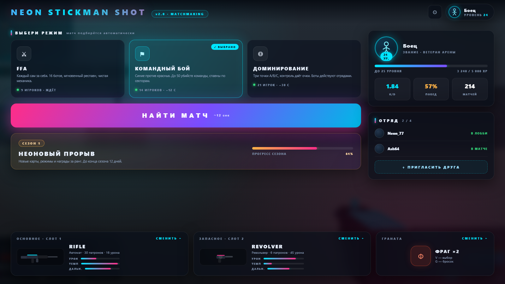
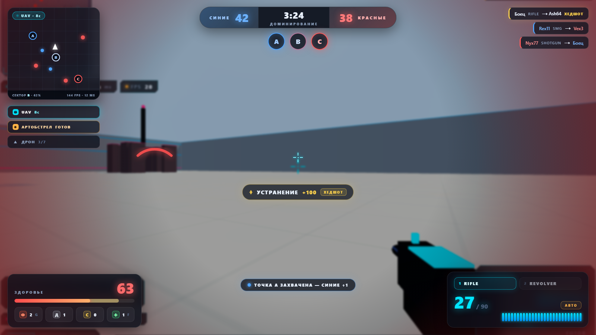
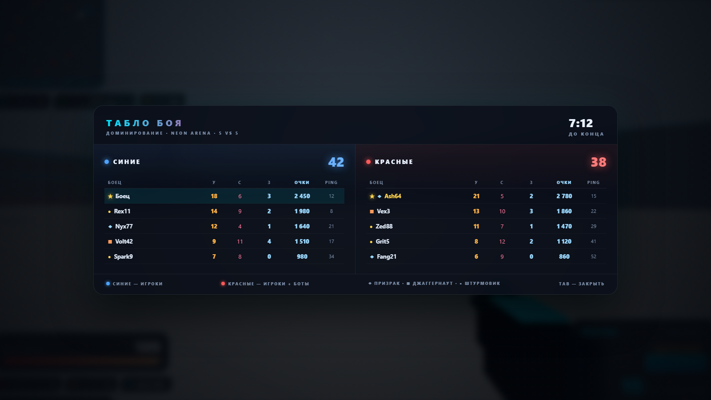

# NEON STICKMAN SHOT — v1.1 «MAXIMUM NEON ARENA»

Онлайн-арена от первого лица: неоновые стикмены, 16 умных ботов с тактическими классами,
реальная перезарядка с магазинами, дым и флеш-гранаты, киллстрики и синтезированный звук.
Клиент — Three.js, сервер — Python + WebSockets (30 тиков/сек).

**Стартовый экран**: живой 3D-фон арены и вращающееся 3D-превью оружия.


---

## Возможности

- **Сетевая FFA-арена** до 16 ботов + игроки, все видят друг друга в реальном времени
- **9 видов оружия** с магазинами, перезарядкой и ограниченным резервом (3 магазина)
- **3 тактических класса ботов** — Призрак, Джаггернаут, Штурмовик (своя модель, ИИ и поведение)
- **Навигация ботов по навмешу** (BFS + сглаживание пути): патрулирование, обход стен, выход через двери
- **3 типа гранат**: фраг, дым (блокирует линию видимости ботов), флеш (слепит ботов и игроков)
- **Киллстрики**: двойные/тройные убийства, награды за серии (HP, гранаты, полный арсенал)
- **Дроп патронов** с убитых — подбирается автоматически, +2 магазина в резерв
- **Аптечки** на карте (+50 HP)
- **Lag compensation**: сервер откатывает позиции цели по пингу стрелка
- **Client-side prediction + server reconciliation**: движение без задержки, честная сверка позиций
- **Пространственный хеш карты** (сетка 20×20) на сервере и клиенте — стабильный FPS при 16+ ботах
- **Процедурный звук через WebAudio** с пулом из 18 переиспользуемых нод (без утечек и заиканий)
- **Профессиональный кибер-интерфейс**: стеклянный морфизм, пипсы патронов, кольцо перезарядки,
  индикатор направления урона, дымные облака из 30 спрайтов, Tab-табло, голо-табло лидера
- **Фоновая музыка**: зацикленный плейлист из двух треков с плавным фейдом (клавиша `M` или кнопка ♪)
- **Стартовый экран**: живой 3D-фон арены, вращающееся 3D-превью выбранного оружия с неоновой подсветкой,
  карточка бойца и карусель арсенала

---

## Быстрый старт

**Требования:** Python 3.10+, браузер с WebGL. Для загрузки Three.js с CDN нужен интернет.

```bash
pip install websockets
python server.py
```

Откройте **http://localhost:8080** в браузере и нажмите «В БОЙ».

### Игра по локальной сети

Сервер печатает адрес при запуске — раздайте его друзьям:

```
Локально:      http://localhost:8080
По сети (LAN): http://192.168.x.x:8080
WebSocket:     ws://192.168.x.x:8001
```

При первом запуске Windows может запросить разрешение брандмауэра — разрешите для портов **8080** и **8001**.

---

## Управление

| Клавиша | Действие |
|---|---|
| `WASD` / стрелки | Движение |
| `Shift` | Бег |
| `Ctrl` / `C` | Присесть |
| `ЛКМ` | Огонь |
| `ПКМ` | Прицел (у снайпера — оптика) |
| `R` | Перезарядка |
| `1-9` | Выбор оружия |
| `Q` / `E` | Смена оружия по кругу |
| `V` | Тип гранаты (фраг/дым/флеш) |
| `G` | Бросок гранаты |
| `F` | Подобрать аптечку |
| `M` | Музыка вкл/выкл |
| `TAB` | Табло боя |

---

## Арсенал

| Оружие | Урон | Магазин | Особенность |
|---|---:|---:|---|
| PISTOL | 20 | 15 | Одиночный, стартовый |
| REVOLVER | 45 | 6 | Тяжёлый, хэдшот ×2 |
| DMR | 38 | 12 | Оптика, точный на дистанции |
| RIFLE | 16 | 30 | Автоматический, универсал |
| BURST | 3×21 | 30 | Очередь по 3 |
| SMG | 11 | 35 | Очень высокий темп, разброс |
| LMG | 19 | 80 | Подавление, магазин 80 |
| SHOTGUN | 8×9 | 7 | Ближний бой |
| SNIPER | 85 | 8 | Оптика, хэдшот ×2 |

Резерв — 3 полных магазина. Патроны выпадают с убитых и подбираются автоматически.

## Классы ботов

| Класс | Оружие | HP | Поведение |
|---|---|---:|---|
| ◆ Призрак | DMR, Sniper | 100 | Дистанция 65–85, отступает при сближении, точный, медленный темп |
| ■ Джаггернаут | Shotgun, LMG | 150 | Дистанция 8–15, бежит в упор, стреляет без задержек |
| ● Штурмовик | Rifle, SMG, Burst и др. | 100 | Дистанция 25–45, адаптивный стрейф, укрытия |

## Гранаты

| Граната | Эффект |
|---|---|
| Фраг | 95 урона по радиусу 9 (с проверкой стен) |
| Дым | Облако на 12 сек, блокирует линию видимости ботов и хитскан |
| Флеш | Слепит ботов и игроков, длительность зависит от дистанции и угла |

---

## Архитектура

```
игра/
├── server.py          # HTTP (8080) + WebSocket (8001), игровая логика, ИИ ботов
├── index.html         # интерфейс: меню, HUD, табло
├── game.js            # Three.js: рендер, карта, модели, эффекты, звук, музыка, сеть
├── style.css          # киберпанк-стили интерфейса
├── assets/
│   └── music/         # фоновые треки (зацикленный плейлист)
├── concept/           # HTML-макеты интерфейса v2.0
└── screenshots/       # скриншоты для README
```

**Сетевой протокол (JSON):**

| Клиент → Сервер | Сервер → Клиент |
|---|---|
| `join` — вход | `init` — стартовый пакет (карта, игроки, аптечки) |
| `state` — позиция/углы (30 Гц) | `state` — состояние мира (30 Гц) |
| `shoot` — выстрел (с пингом для lag comp) | `shoot` / `hit` / `kill` — события боя |
| `reload` — перезарядка | `reload` — начало перезарядки |
| `grenade` — бросок (kind) | `grenade_spawn` / `smoke_spawn` / `flash_pop` |
| `weapon` — смена оружия | `streak` — серии и награды |
| `pickup_medkit` / `pickup_ammo` | `medkit_taken` / `pickup_taken` |
| `ping` | `pong` (измерение пинга) |

**Технические детали:**

- Тик-рейт 30 Гц; позиции интерполируются на клиенте (`LERP_SPEED`)
- Пространственный хеш 20×20: 311 ячеек, навигация строится за ~0.04 с
- Lag compensation: история позиций 12 тиков, откат до 250 мс по пингу стрелка
- Предсказание движения локальное; примирение — по позиции, отправленной ~пинг назад
- Аудио-пул: 10 шумовых + 8 тональных голосов, ноды не создаются в рантайме
- Карта: 160 коллайдеров, 681 навигационная точка, 16 фиксированных аптечек

---

## Материалы и медиа

| Материал | Где | Как используется |
|---|---|---|
| `magnific-24k.mp3`, `magnific-ckt-rip.mp3` | `assets/music/` | Фоновый зацикленный плейлист: треки играют по кругу с плавным фейдом. Стартует после первого клика (политика автовоспроизведения браузеров), управление — `M` или кнопка ♪ в меню, выбор mute сохраняется в localStorage |
| Шрифт Changa One | Google Fonts | Подключён для латинских заголовков (логотип, названия оружия в меню и HUD) |

---

## Планы на версию 2.0 — «MATCHMAKING»

Концепт нового интерфейса готов: интерактивные HTML-макеты лежат в папке [`concept/`](concept/)
и открываются в браузере без сервера.

### Меню: матчмейкинг, профиль, лоадауты и сезон



### HUD: командный режим, точки A/B/C, киллстрик-награды



### Табло: две команды, очки, захваты точек



### Что войдёт в 2.0

| Направление | Содержание |
|---|---|
| **Комнаты и матчмейкинг** | Несколько матчей на одном сервере, выбор режима, лобби, вход по коду |
| **Режимы** | FFA · Командный бой (до 50 убийств) · Доминирование (точки A/B/C) |
| **Серверная честность** | Валидация движения и коллизий на сервере (античит), проверка скорости и телепортов |
| **Киллстрик-награды** | UAV (враги видны на миникарте), артобстрел по выбранной зоне, дрон-камикадзе |
| **Лоадауты** | Слоты Primary + Secondary, патроны живут на слот, смена оружия в меню |
| **Профиль и прогрессия** | Уровни, XP, K/D, процент побед, сезоны с наградами |
| **Прыжки и вертикальность** | Гравитация, рампы, второй этаж зданий, мосты |
| **Новая карта** | «Ночной город» — неон в темноте, bloom-освещение |
| **Killcam** | Повтор убийства от лица убийцы (история позиций уже пишется сервером) |
| **Технологии** | Бинарный протокол (MessagePack), дельта-состояния, тик 60 Гц, настройки в localStorage |

### Дорожная карта

| Фаза | Содержание |
|---|---|
| **1. Фундамент** | Room-рефакторинг, серверная валидация движения, меню настроек |
| **2. Геймплей** | Командные режимы и счёт, лоадауты, киллстрик-награды, чат |
| **3. Мир** | Прыжки, рампы, карта «Ночной город» |
| **4. Полировка** | Killcam, bloom и пресеты качества, режим наблюдателя |

---

## Версия

**v1.0 «MAXIMUM NEON ARENA»** — первый релиз: арена, 9 оружий, 16 ботов, дым/флеш, киллстрики.
**v1.1 «MAXIMUM NEON ARENA»** — редизайн стартового экрана: живой 3D-фон арены, вращающееся
3D-превью оружия с неоновой подсветкой, карточка бойца, новая карусель арсенала;
фоновая зацикленная музыка (`M` или кнопка ♪); дисплей-шрифт Changa One.
**v2.0 «MATCHMAKING»** — в разработке: концепт интерфейса готов, см. выше.
