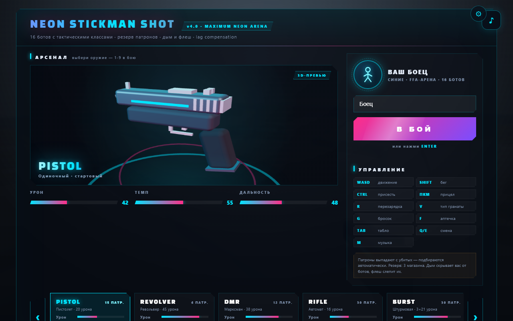
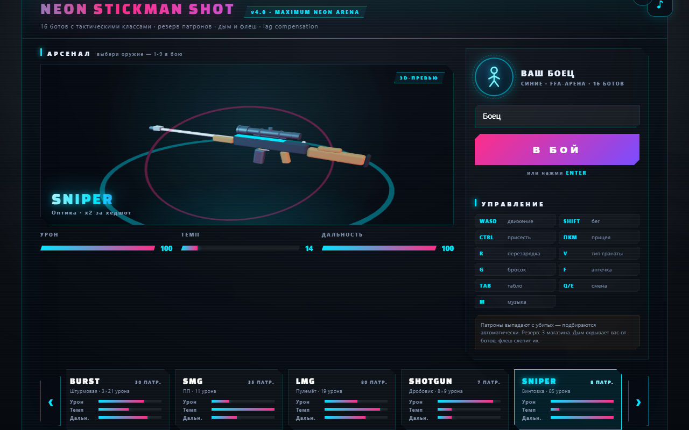
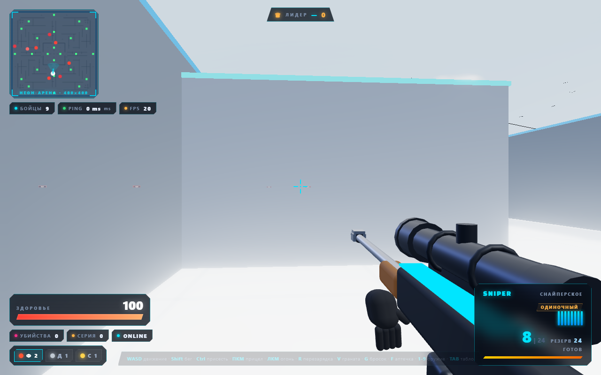
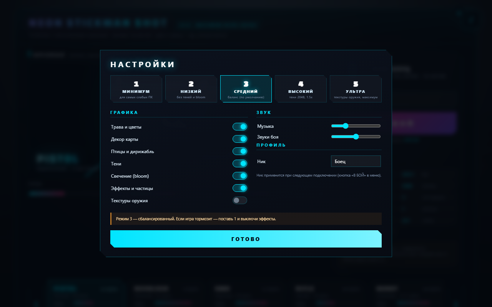
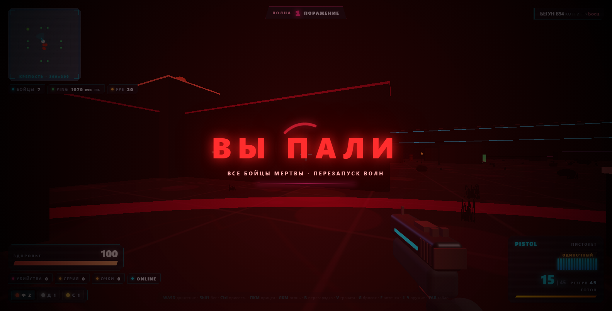
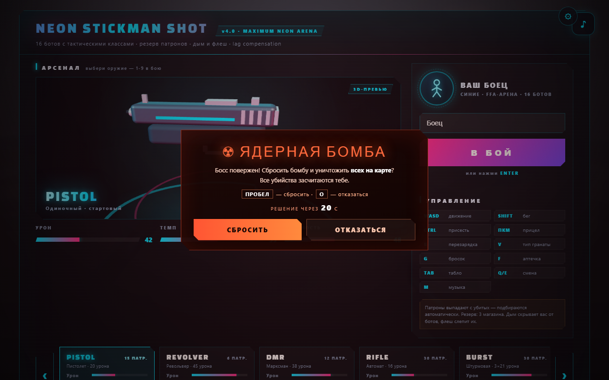
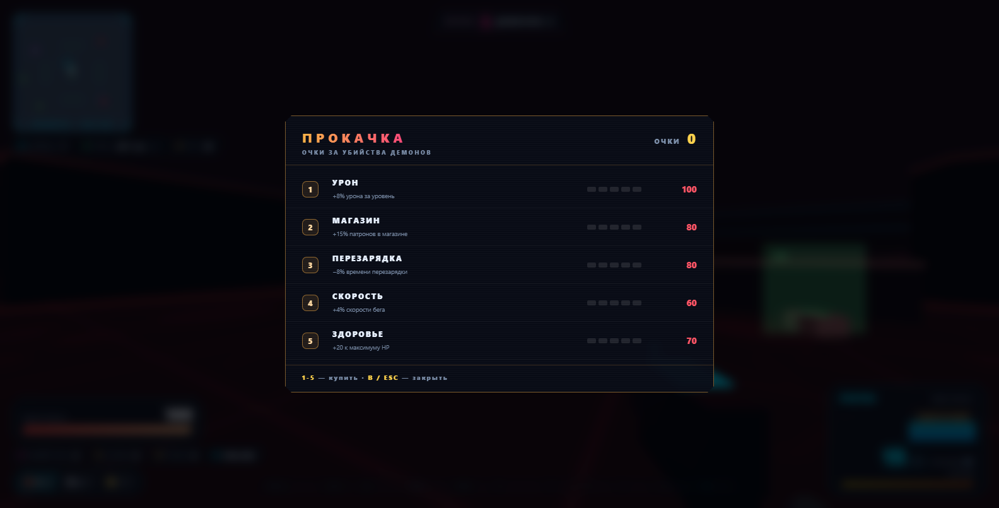
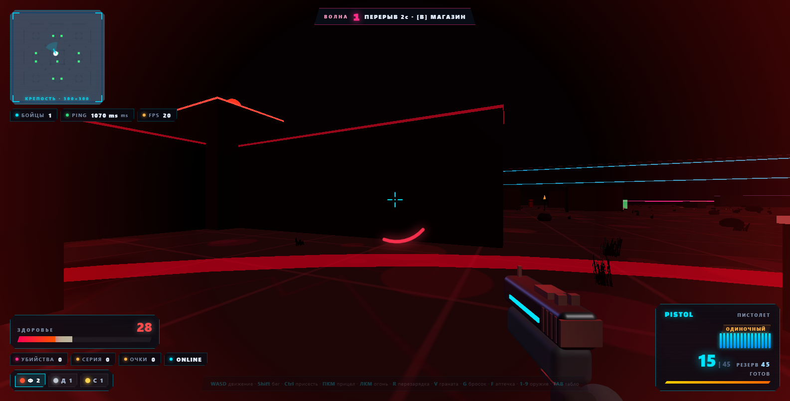

# NEON STICKMAN SHOT — v3.0 «ЖИВОЙ МИР»

Онлайн-шутер от первого лица с двумя режимами: **арена FFA** (боты-люди с оружием и тактическими
классами + босс в центре с ядерной наградой) и **оборона крепости** от бесконечных волн демонов.
Реалистичные люди с двусочленённым ригом, переработанные модели оружия, живое окружение
(трава, птицы, дирижабль), **5 режимов графики** с тонкой настройкой под любой ПК,
пауза-меню прямо в бою. Клиент — Three.js (ES-модули), сервер — Python + WebSockets (30 тиков/сек).







---

## Возможности

- **5 режимов графики** (1 — для самых слабых ПК, 5 — ультра) + ручные тумблеры: трава, декор,
  птицы, тени, bloom, эффекты, текстуры оружия; громкость музыки и звуков; сохранение в браузере
- **Пауза-меню в бою** (`Esc`): настройки, смена ника, звук и выход в меню без перезапуска
- **Босс ТИТАН в центре FFA**: не уходит с центра, 3000 HP; за убийство — выбор:
  сбросить **ядерную бомбу** (все на карте погибают, убийства засчитываются тебе) или отказаться;
  следующий босс — через 15 минут
- **Два режима**: FFA-арена и «Оборона» — переключаются в `config.json`
- **FFA-арена**: боты-люди трёх тактических классов (Призрак, Джаггернаут, Штурмовик) —
  стреляют из оружия, стрейфят, лечатся аптечками и кидают гранаты
- **Новая карта FFA «Мегаполис»**: открытая площадь в центре, 4 туннеля с зигзаг-баффлами,
  кольцевой коридор, 4 угловые башни и лабиринты в квадрантах (в духе CS2)
- **5 типов демонов** (режим обороны): Бегун, Громила, Визгун, Плевун и Титан (босс каждые 5 волн) —
  **не стреляют**: когти, удар по земле с волной, звуковой визг и летящие кислотные снаряды
- **Взрыв демона при смерти** — наносит урон по радиусу, как граната
- **Волны в обороне**: бесконечные, каждая волна больше и сильнее, 30 секунд перерыва на отдых
- **Экономика**: 10 очков за демона, магазин по `B` — 5 веток прокачки с потолком уровней
- **9 видов оружия** — переработанные модели (стволы, затворы, планки, оптика) с магазинами,
  перезарядкой и ограниченным резервом (3 магазина); текстуры металла/дерева — на ультра-графике
- **Живое окружение**: трава, цветы, кусты и камни по всей карте (ветер в шейдере), фонари с проводами,
  лужи, обломки; в обороне — мёртвые деревья, кости и жаровни; птицы, облака и дирижабль в небе
- **Реалистичные персонажи**: люди с двусочленёнными конечностями (колени, локти) и оружием по классу
- **Навигация по навмешу** (BFS + flow-field к центру крепости для десятков демонов)
- **3 типа гранат**: фраг, дым (радиус 10.8, блокирует линию видимости), флеш (ровно 4 секунды белого экрана)
- **Киллстрики**: двойные/тройные убийства, награды за серии (HP, гранаты, полный арсенал)
- **Дроп патронов** с убитых — подбирается автоматически, +2 магазина в резерв
- **Аптечки** на карте (+50 HP)
- **Lag compensation**: сервер откатывает позиции цели по пингу стрелка
- **Client-side prediction + server reconciliation**: движение без задержки, честная сверка позиций
- **Пространственный хеш карты** (сетка 20×20) на сервере и клиенте — стабильный FPS при 16+ ботах
- **Процедурный звук через WebAudio** с пулом из 18 переиспользуемых нод (без утечек и заиканий)
- **Профессиональный кибер-интерфейс**: стеклянный морфизм, пипсы патронов, кольцо перезарядки,
  индикатор направления урона, дымные облака из 30 спрайтов, Tab-табло, голо-табло лидера
- **Фоновая музыка**: зацикленный плейлист из двух треков с плавным фейдом (клавиша `M` или кнопка ♪)
- **Стартовый экран**: живой 3D-фон арены, вращающееся 3D-превью выбранного оружия с неоновой подсветкой,
  карточка бойца и карусель арсенала
- **Хоррор-атмосфера обороны**: ночная карта «Крепость», кровавая луна, визги и рык демонов,
  гул-дрон, сердцебиение при опасности, шёпот в перерывах

---

## Быстрый старт

**Требования:** Python 3.10+, браузер с WebGL. Для загрузки Three.js с CDN нужен интернет.

```bash
pip install websockets
python server.py
```

Откройте **http://localhost:8080** в браузере и нажмите «В БОЙ».

### Игра по локальной сети

Сервер печатает адрес при запуске — раздайте его друзьям:

```
Локально:      http://localhost:8080
По сети (LAN): http://192.168.x.x:8080
WebSocket:     ws://192.168.x.x:8001
```

При первом запуске Windows может запросить разрешение брандмауэра — разрешите для портов **8080** и **8001**.

---

## Управление

| Клавиша | Действие |
|---|---|
| `WASD` / стрелки | Движение |
| `Shift` | Бег |
| `Ctrl` / `C` | Присесть |
| `ЛКМ` | Огонь |
| `ПКМ` | Прицел (у снайпера — оптика) |
| `R` | Перезарядка |
| `1-9` | Выбор оружия |
| `Q` / `E` | Смена оружия по кругу |
| `V` | Тип гранаты (фраг/дым/флеш) |
| `G` | Бросок гранаты |
| `F` | Подобрать аптечку |
| `I` | Осмотреть оружие |
| `B` | Магазин прокачки (режим обороны) |
| `1-5` | Покупка апгрейдов (когда магазин открыт) |
| `M` | Музыка вкл/выкл |
| `TAB` | Табло боя |
| `ESC` | Пауза (настройки, смена ника, выход в меню) |
| `ПРОБЕЛ` / `O` | Сбросить / отказаться от ядерной бомбы (после убийства босса) |

---

## Режимы графики (настройки)

По умолчанию у всех включён режим **3 (СРЕДНИЙ)**. Открыть настройки: кнопка **⚙** в меню
или `ESC` → «Настройки» прямо в бою. Всё сохраняется в браузере.

| Режим | Разрешение | Тени | Bloom | Эффекты | Трава/декор | Текстуры оружия |
|---|---|---:|---|---:|---|---|
| **1 МИНИМУМ** | 0.5× | выкл | выкл | 35% | выкл | выкл |
| **2 НИЗКИЙ** | 0.7× | выкл | выкл | 60% | трава | выкл |
| **3 СРЕДНИЙ** | 1.0× | 1024 | вкл | 100% | всё | выкл |
| **4 ВЫСОКИЙ** | 1.5× | 2048 | вкл | 100% | всё | выкл |
| **5 УЛЬТРА** | 2.0× | 2048 | вкл | 100% | всё | вкл |

Любой параметр можно переопределить вручную тумблерами: **трава и цветы**, **декор карты**
(фонари, лужи, жаровни), **птицы и дирижабль**, **тени**, **свечение (bloom)**, **эффекты и частицы**,
**текстуры оружия**. Отдельно — громкость **музыки** и **звуков боя**, смена ника.
Если FPS ниже 35 в первые секунды боя, bloom отключается автоматически.

## Босс и ядерная бомба (FFA)

В центре «Мегаполиса» стоит **ТИТАН-БОСС** (3000 HP) — он не покидает центр и простреливает
площадь. Появляется через 60 секунд после старта, после смерти — новый через **15 минут**.
Убийца босса получает выбор (20 секунд):

- **ПРОБЕЛ — сбросить ядерную бомбу**: все игроки и боты на карте погибают разом,
  **все убийства засчитываются тебе** (серии, киллфид, награды);
- **O — отказаться**: бомба пропадает, все видят уведомление об отказе.



Настройки босса — в `config.json` → `ffa`: `boss_hp`, `boss_spawn_delay`, `boss_respawn_seconds`.

## Арсенал

| Оружие | Класс | Урон | Темп | Магазин | Перезарядка | Резерв |
|---|---|---:|---:|---:|---:|---:|
| PISTOL | пистолет | 20 | 5/с | 15 | 1.4 с | 45 |
| REVOLVER | пистолет | 45 | 1.4/с | 6 | 1.9 с | 18 |
| DMR | марксман | 38 | 3.3/с | 12 | 1.8 с | 36 |
| RIFLE | штурмовое | 16 | 10.5/с | 30 | 2.0 с | 90 |
| BURST | штурмовое | 3×21 | очередь 0.55 с | 30 | 2.1 с | 90 |
| SMG | ПП | 11 | 16.7/с | 35 | 1.7 с | 105 |
| LMG | пулемёт | 19 | 10/с | 80 | 3.4 с | 240 |
| SHOTGUN | дробовик | 8×9 | 1.25/с | 7 | 2.6 с | 21 |
| SNIPER | снайперское | 85 | 0.77/с | 8 | 2.8 с | 24 |

Хэдшот у всех — **×2**. Урон падает с дистанцией: сильнее всего у дробовика и SMG,
почти незаметно у снайперки и DMR.

**Описания:**

- **PISTOL** — стартовый пистолет. Ровный, быстрый, с приличным магазином на 15; заметно слабеет
  на дистанции. Хорош, пока не найден труп с чем-то серьёзнее.
- **REVOLVER** — револьвер «на один точный выстрел»: 45 урона и 90 за хэдшот. Всего 6 патронов
  и долгая перезарядка — оружие уверенной руки.
- **DMR** — марксманская винтовка с оптикой: 38 урона при 3.3 выстрела в секунду и малый
  падением урона на дистанции. Универсал для средних и дальних перестрелок.
- **RIFLE** — автоматическая штурмовая винтовка: 30 патронов, ~10 выстрелов в секунду,
  контролируемая отдача. Рабочая лошадка арены в любой ситуации.
- **BURST** — винтовка с очередью по 3: один клик — 63 урона в точку. Награждает
  дисциплину стрельбы и прицеливание в голову.
- **SMG** — пистолет-пулемёт: самый высокий темп (16.7/с) и большой магазин, но урон тает
  с расстоянием и разброс велик. Король ближних коридоров.
- **LMG** — пулемёт на 80 патронов: плотный автоматический огонь для подавления и обороны
  точек; тяжёлый, разброс растёт в движении.
- **SHOTGUN** — дробовик: 8 дробинок по 9 урона, в упор — мгновенное удаление цели.
  Дальше 15 метров почти бесполезен.
- **SNIPER** — снайперская винтовка с оптикой: 85 урона (170 за хэдшот), практически
  без падения урона. Один выстрел — один труп, но промах стоит 1.3 секунды.

Резерв — 3 полных магазина. Патроны выпадают с убитых и подбираются автоматически.

## Демоны (режим обороны)

| Тип | HP | Скорость | Атаки | Особенность |
|---|---:|---:|---|---|
| Бегун | 60 | 5.4 | Когти | Быстрый, слабый |
| Громила | 240 | 2.7 | Когти + удар по земле (AoE) | Танк, огромный взрыв при смерти |
| Визгун | 95 | 3.5 | Когти + визг (урон по площади) | Визгом ускоряет демонов рядом |
| Плевун | 85 | 3.2 | Кислотный снаряд (летящий, уклоняемый) | Атакует с дистанции до 34 м |
| Титан | 1600 | 2.3 | Всё | Босс каждой 5-й волны |

Демоны видят только игроков, идут по навмешу (в обороне — по flow-field к центру),
и **никогда не стреляют из оружия**. Их способы атаки: когти в упор, удар по земле
с ударной волной, звуковой визг и кислотные снаряды, которые летят по прямой
и разбрызгиваются при попадании (их можно уклонять). При смерти каждый демон
взрывается и наносит урон по радиусу.

**Хитбоксы** масштабируются под размер модели: у Громилы голова на высоте ~3.4 м,
у Титана ~5.4 м — попадания и хедшоты считаются честно по каждой части.

## Гранаты

| Граната | Эффект |
|---|---|
| Фраг | 95 урона по радиусу 9 (с проверкой стен) |
| Дым | Облако на 12 сек, блокирует линию видимости ботов и хитскан |
| Флеш | Слепит ботов и игроков, длительность зависит от дистанции и угла |

---

## Режимы и конфигурация

Режим переключается в **`config.json`** (сервер читает его при старте, клиент — при загрузке):

```json
{
    "mode": "ffa",
    "ffa": {
        "max_bots": 16,
        "boss_hp": 3000,
        "boss_spawn_delay": 60,
        "boss_respawn_seconds": 900
    },
    "defense": {
        "break_seconds": 30,
        "points_per_kill": 10,
        "wave_base": 6,
        "wave_growth": 3,
        "max_alive": 48
    }
}
```

- **`"mode": "ffa"`** — арена: боты-люди охотятся на всех, свободный респавн, аптечки и дроп патронов;
  в центре — босс ТИТАН с ядерной наградой
- **`"mode": "defense"`** — «Оборона»: игроки спавнятся в центре крепости, волны демонов
  идут с краёв карты. Волна зачищена → 30 секунд перерыва (лечение, гранаты, магазин) →
  следующая волна: демонов больше и они сильнее. Все игроки мертвы → «ВЫ ПАЛИ» и рестарт волн.




**Прокачка (магазин по `B`):** 5 веток, у каждой 5 уровней с растущей ценой —
урон (+8%/ур), магазин (+15%/ур), перезарядка (−8%/ур), скорость (+4%/ур), здоровье (+20/ур).
Рост демонов опережает прокачку — расслабляться нельзя.

## Архитектура

```
игра/
├── server.py          # HTTP (8080) + WebSocket (8001), игровая логика, ИИ демонов, волны
├── config.json        # режим игры и настройки обороны
├── index.html         # интерфейс: меню, HUD, табло, магазин (importmap three + addons)
├── game.js            # точка входа: карта, ввод, стрельба, движение, камера, bloom-рендер
├── js/
│   ├── core.js        # CFG, DOM, состояние мира, утилиты, пространственный хеш, ray-математика
│   ├── audio.js       # WebAudio-пул (AU), пространственный звук, фоновый плейлист (Music)
│   ├── effects.js     # дым, частицы, трассеры, взрывы, горе, кислота, меши гранат/аптечек
│   ├── weapons.js     # реалистичные модели оружия (PBR-текстуры), viewmodel, витрина меню
│   ├── characters.js  # люди с ригом колени/локти, демоны, ники, интерполяция и анимация
│   ├── decor.js       # трава/кусты/цветы/камни (instanced + ветер), фонари, лужи, жаровни
│   ├── sky.js         # небо, облака, птицы/мыши, дирижабль
│   ├── hud.js         # HUD, TAB-табло, миникарта, волны, магазин, киллфид, баннеры, ядерка
│   ├── settings.js    # 5 режимов графики, тумблеры, звук, профиль (localStorage)
│   └── net.js         # WebSocket: подключение, все обработчики, отправка состояния
├── style.css          # киберпанк-стили интерфейса
├── assets/
│   └── music/         # фоновые треки (зацикленный плейлист)
├── concept/           # HTML-макеты интерфейса v2.0
└── screenshots/       # скриншоты для README
```

**Сетевой протокол (JSON):**

| Клиент → Сервер | Сервер → Клиент |
|---|---|
| `join` — вход | `init` — стартовый пакет (карта, игроки, аптечки) |
| `state` — позиция/углы (30 Гц) | `state` — состояние мира (30 Гц) |
| `shoot` — выстрел (с пингом для lag comp) | `shoot` / `hit` / `kill` — события боя |
| `reload` — перезарядка | `reload` — начало перезарядки |
| `grenade` — бросок (kind) | `grenade_spawn` / `smoke_spawn` / `flash_pop` |
| `weapon` — смена оружия | `streak` — серии и награды |
| `pickup_medkit` / `pickup_ammo` | `medkit_taken` / `pickup_taken` |
| `ping` | `pong` (измерение пинга) |
| `nuke_use` / `nuke_deny` | `boss_spawn` / `boss_defeated` / `boss_down` / `nuke` / `nuke_denied` |

**Технические детали:**

- Тик-рейт 30 Гц; позиции интерполируются на клиенте (`LERP_SPEED`)
- Пространственный хеш 20×20: 311 ячеек, навигация строится за ~0.04 с
- Lag compensation: история позиций 12 тиков, откат до 250 мс по пингу стрелка
- Предсказание движения локальное; примирение — по позиции, отправленной ~пинг назад
- Аудио-пул: 10 шумовых + 8 тональных голосов, ноды не создаются в рантайме
- Карта: 160 коллайдеров, 681 навигационная точка, 16 фиксированных аптечек
- Клиент — ES-модули (9 файлов в `js/`), циклов нет: `game.js` собирает всё вместе
- Bloom-постобработка (EffectComposer + UnrealBloomPass + OutputPass) с авто-отключением
  при среднем FPS < 35 за первые 5 секунд; viewmodel рендерится поверх через clearDepth
- Растительность — InstancedMesh с ветром в вершинном шейдере (`onBeforeCompile`),
  вся трава/цветы/кусты/камни — 4 draw call; птицы и мыши — 2 instanced-меша
- Модели оружия: процедурные canvas-текстуры (карта + нормали + шероховатость) — только на
  ультра-графике; ниже — чистые PBR-материалы без текстур (экономия памяти и FPS)
- Настройки графики: pixelRatio 0.5–2.0, размер shadow map 512–2048, множитель эффектов,
  видимость декора/птиц — применяются на лету без перезагрузки
- Босс: хитбоксы масштабируются (×1.45), стрельба через общий `process_shoot` (lag comp, стены, дым);
  ядерка убивает всех через `apply_death` — убийства и серии засчитываются инициатору

---

## Материалы и медиа

| Материал | Где | Как используется |
|---|---|---|
| `magnific-24k.mp3`, `magnific-ckt-rip.mp3` | `assets/music/` | Фоновый зацикленный плейлист: треки играют по кругу с плавным фейдом. Стартует после первого клика (политика автовоспроизведения браузеров), управление — `M` или кнопка ♪ в меню, выбор mute сохраняется в localStorage |
| Шрифт Changa One | Google Fonts | Подключён для латинских заголовков (логотип, названия оружия в меню и HUD) |

---

## Версия

**v1.0 «MAXIMUM NEON ARENA»** — первый релиз: арена, 9 оружий, 16 ботов, дым/флеш, киллстрики.
**v1.1 «MAXIMUM NEON ARENA»** — редизайн стартового экрана: живой 3D-фон арены, вращающееся
3D-превью оружия с неоновой подсветкой, карточка бойца, новая карусель арсенала;
фоновая зацикленная музыка (`M` или кнопка ♪); дисплей-шрифт Changa One.
**v2.0 «НОЧЬ ДЕМОНОВ»** — режим «Оборона» с бесконечными волнами, экономикой и прокачкой;
демоны с процедурной анимацией, взрывом при смерти и «монстровыми» атаками (когти, слэм, визг,
кислотные снаряды) — только в обороне; в FFA остались боты-люди с оружием;
новая карта FFA «Мегаполис» (площадь, туннели, башни, лабиринты); хитбоксы по размеру модели;
дым ×3 (1 draw call), флеш ровно на 4 секунды; хоррор-звуки и атмосфера.
**v3.0 «ЖИВОЙ МИР»** — полный реализм и живое окружение: боты и игроки — люди с двусочленённым
ригом (колени, локти) вместо стикменов; модели оружия пересобраны заново (стволы, затворы, планки,
оптика, приклады, магазины) — текстуры металла/дерева включаются только на ультра-графике;
стадийная перезарядка, спринт-поза и осмотр оружия (`I`); декор карты — трава, цветы, кусты и камни
по всей арене (instanced + ветер), фонари с проводами, лужи и обломки в «Мегаполисе», мёртвые деревья,
кости и жаровни в обороне; птицы, облака и дирижабль в небе (мыши — ночью); **5 режимов графики**
(1 — минимум для слабых ПК, 3 — по умолчанию, 5 — ультра) с ручными тумблерами (трава, декор, птицы,
тени, bloom, эффекты, текстуры) и слайдерами громкости; **пауза-меню** (`Esc`) с настройками,
сменой ника и выходом в меню; **босс ТИТАН-БОСС** в центре FFA с наградой — ядерной бомбой
(ПРОБЕЛ — сбросить, O — отказаться; все убийства засчитываются); клиент разбит на
ES-модули (core/audio/effects/weapons/characters/decor/sky/hud/settings/net).
